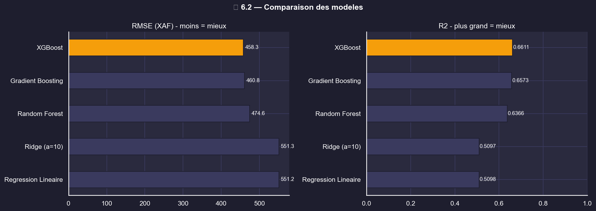
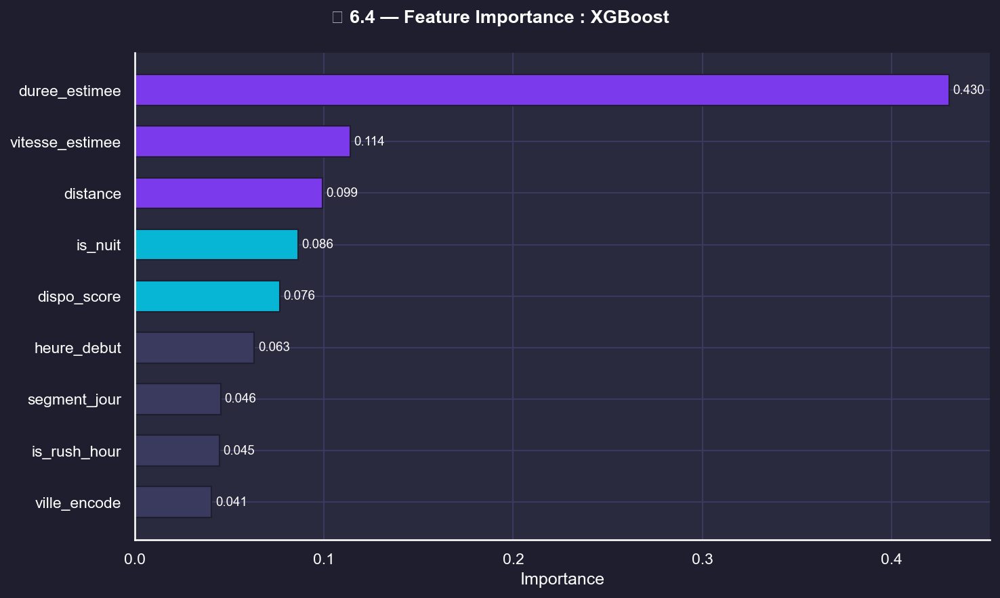

# 🚖 Sosso Trajet · Ride fare prediction in Yaoundé & Douala

> 🥉 **3rd place · Data4Change Hackathon 2026**

Machine learning project that predicts the price of a ride-hailing trip in **Yaoundé** and **Douala** (Cameroon) from its distance, duration, time of day and vehicle availability, and helps users pick the best moment to travel.


---

## 📊 Dataset

`SossoTrajet_Dataset.csv` contains **7,341 trips** with 11 columns:

| Column | Description |
|---|---|
| `ville` | City (Yaoundé or Douala) |
| `depart`, `arrivee` | Pick-up and drop-off locations |
| `distance`, `duree_estimee` | Distance (km) and estimated duration (min) |
| `prix_eco`, `prix_confort`, `prix_confort_plus` | Fares for the three service levels (XAF) |
| `heure_plage` | Time slot (e.g. `13h–14h`) |
| `disponibilite_vehicules` | Vehicle availability (`vert` → `gris`) |

## 🔬 Approach

1. **Exploratory analysis** (`SossoTrajet_Analysis.ipynb`): distributions, city balance, hourly volume, correlations.
2. **Data cleaning**
   - Missing fares imputed with the **median of similar trips** (same city, same time slot), with a global median as fallback.
   - Outliers detected with the **IQR method**, then clipped to the 1st–99th percentiles.
   - Log-transform of the target to stabilise variance.
3. **Feature engineering**: rush hour and night flags, day segment, availability score, encoded city, estimated speed.
   Features derived from the target were removed to avoid **data leakage**.
4. **Modelling** (`SossoTrajet_Modeling.ipynb`): 5 models compared with cross-validation and a hold-out test set.

## 🏆 Results

Target: `prix_eco` (economy fare).

| Model | RMSE (XAF) | MAE (XAF) | R² | MAPE |
|---|---:|---:|---:|---:|
| Linear Regression | 551.2 | 332.7 | 0.510 | 24.96% |
| Ridge (α=10) | 551.3 | 332.7 | 0.510 | 24.96% |
| Random Forest | 474.6 | 262.6 | 0.637 | 19.38% |
| Gradient Boosting | 460.8 | 260.8 | 0.657 | 19.38% |
| **XGBoost** ✅ | **458.3** | **255.8** | **0.661** | **18.98%** |

The **XGBoost** model is saved in `models/` with its configuration (features, encodings, medians and clipping bounds) so that predictions can be reproduced.

<p align="center">
  
  
</p>

## 🗂️ Repository structure

```
├── SossoTrajet_Dataset.csv         # Raw dataset (7,341 trips)
├── SossoTrajet_Analysis.ipynb      # Exploratory data analysis and cleaning
├── SossoTrajet_Modeling.ipynb      # Feature engineering, model comparison, export
├── models/                         # Saved XGBoost model + JSON configuration
├── interface.html                  # Fare estimation interface
├── Explication_Simple.md           # Non-technical explanation (French)
├── Projet3_SossoTrajet.docx.pdf    # Project report
└── viz_*.png                       # Charts generated by the notebooks
```

## 🚀 Getting started

```bash
git clone https://github.com/ALEMDJOU/sosso-trajet-hackathon-2026.git
cd sosso-trajet-hackathon-2026
pip install pandas numpy scikit-learn xgboost matplotlib seaborn joblib jupyter
jupyter notebook
```

Run `SossoTrajet_Analysis.ipynb`, then `SossoTrajet_Modeling.ipynb`.

Load the trained model:

```python
import joblib, json, numpy as np

model = joblib.load("models/sosso_trajet_XGBoost_20260418_1456.joblib")
config = json.load(open("models/sosso_trajet_config_20260418_1456.json"))
# Build a DataFrame with the columns listed in config["features"], then:
# price_xaf = np.expm1(model.predict(X))   # the model predicts log1p(prix_eco)
```

## 🔭 Next steps

- Test LightGBM for faster CPU training
- Predict the comfort and comfort+ fares
- Recommend the cheapest departure time slot for a given trip

---

👤 **Henri Joël Fofack Alemdjou** · [Portfolio](https://portfoliofofackhenri.vercel.app/) · [LinkedIn](https://linkedin.com/in/henri-fofack-250b1b320)
